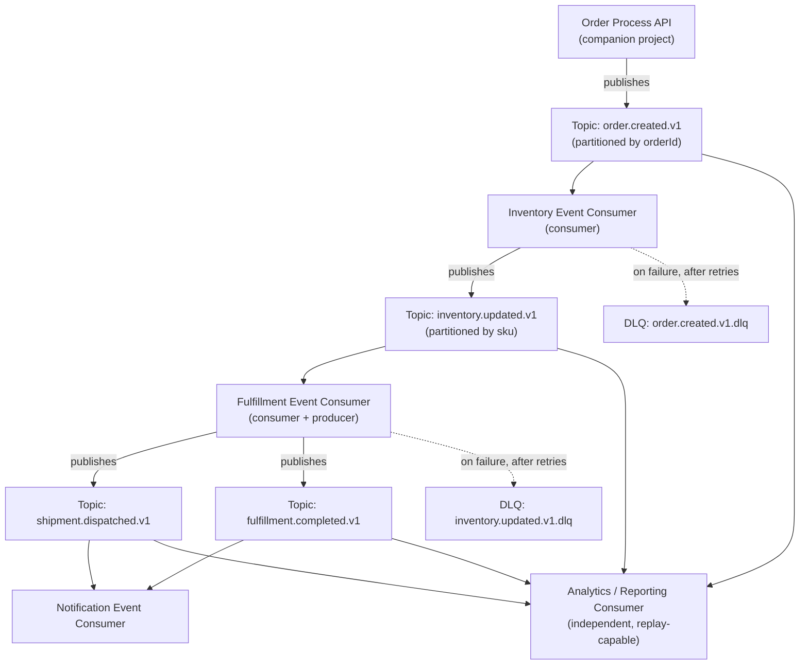

# Event-Driven Supply Chain Integration

**Asynchronous, event-driven MuleSoft integration** — inventory, order, shipment, and fulfillment events processed via Kafka for a fictional multi-channel consumer goods enterprise.

> **Fictional scenario, no proprietary information.** Extends the same fictional company used in the companion project, [`enterprise-order-integration-platform`](https://github.com/raghubavaraju/enterprise-order-integration-platform). No proprietary information from any real employer appears anywhere in this repository — see [Fictional Scenario Disclosure](#fictional-scenario-disclosure) below.

## What This Project Demonstrates

Where the companion project shows synchronous API-led connectivity, this project shows the other half of an integration architect's toolkit: recognizing *when* synchronous request-reply is the wrong fit, and designing an asynchronous, event-driven system correctly — including the operational concerns (idempotency, DLQ, replay, ordering) that make event-driven architectures hard in practice.

## Start Here

| If you want to... | Read this |
|---|---|
| Understand why this needs to be event-driven at all | [`docs/business-scenario.md`](docs/business-scenario.md) |
| See the full event flow, retry, and replay design | [`docs/event-flow-and-design.md`](docs/event-flow-and-design.md) |
| See the diagram | [`diagrams/architecture-overview.mmd`](diagrams/architecture-overview.mmd) (rendered below) |
| See why Kafka over Anypoint MQ | [`docs/decisions/ADR-001-kafka-vs-anypoint-mq.md`](docs/decisions/ADR-001-kafka-vs-anypoint-mq.md) |
| See actual Mule implementation | [`mule-apps/`](mule-apps) |
| Operate this in production | [`docs/operational-runbook.md`](docs/operational-runbook.md) |

## Architecture Diagram

## Business Scenario (Summary)

Order creation triggers a chain of independent, asynchronous reactions across Inventory, Fulfillment, Notification, and Analytics — a case where synchronous orchestration would wrongly couple these systems together. Full write-up: [`docs/business-scenario.md`](docs/business-scenario.md).

## Messaging Technology: Kafka (Anypoint MQ Documented as the Alternative)

This project uses **Kafka**, chosen specifically for two requirements this scenario has: multi-consumer fan-out (Inventory, Fulfillment, Notification, and Analytics all read from the same events without knowing about each other) and **event replay** (for analytics backfill and incident recovery). **Anypoint MQ** was seriously considered and remains the better choice in scenarios without a replay requirement — full trade-off analysis in [ADR-001](docs/decisions/ADR-001-kafka-vs-anypoint-mq.md).

## Event Flow Documentation

Producers, consumers, per-topic partition/ordering design, asynchronous processing model, duplicate-event handling, and retry strategy: [`docs/event-flow-and-design.md`](docs/event-flow-and-design.md) and [ADR-002 (partitioning)](docs/decisions/ADR-002-event-ordering-and-partitioning.md).

## Event Schemas and Sample Events

JSON Schema definitions (working examples) and fictional sample payloads for all four event types, plus a sample DLQ envelope: [`event-schemas/`](event-schemas).

| Event | Producer | Schema |
|---|---|---|
| `OrderCreated` | Order Event Producer | [`order-created.v1.schema.json`](event-schemas/order-created.v1.schema.json) |
| `InventoryUpdated` | Inventory Event Consumer | [`inventory-updated.v1.schema.json`](event-schemas/inventory-updated.v1.schema.json) |
| `ShipmentDispatched` | Fulfillment Event Consumer | [`shipment-dispatched.v1.schema.json`](event-schemas/shipment-dispatched.v1.schema.json) |
| `FulfillmentCompleted` | Fulfillment Event Consumer | [`fulfillment-completed.v1.schema.json`](event-schemas/fulfillment-completed.v1.schema.json) |

## Mule Application Structure

Four Mule 4 / Maven applications (one producer, two fully-implemented consumers, one pseudocode consumer for pattern illustration) plus a shared DLQ-routing error handler: [`mule-apps/`](mule-apps) (see its [README](mule-apps/README.md) for the exact tree and per-file status).

## DataWeave Transformations

Each app's `dwl/` folder holds its event-mapping transformation(s): OrderSummary → `OrderCreated`, `OrderCreated` → `InventoryUpdated` (one per line item), and `InventoryUpdated` → `ShipmentDispatched`.

## Error Handling and Dead-Letter Queue Design

Shared, reusable DLQ-routing error handler classifying transient vs. permanent failures: [`mule-apps/common/dlq-error-handler.xml`](mule-apps/common/dlq-error-handler.xml), documented in [`docs/error-handling-dlq-and-recovery.md`](docs/error-handling-dlq-and-recovery.md).

## Idempotency Design

Deduplication by `eventId` via a persistent Object Store, plus defense-in-depth idempotent business logic: [`docs/idempotency-and-deduplication.md`](docs/idempotency-and-deduplication.md).

## Monitoring, Observability, and Correlation IDs

Correlation ID propagation across asynchronous boundaries, structured logging, metrics, and alerting targets: [`docs/observability-and-monitoring.md`](docs/observability-and-monitoring.md).

## Event Versioning

Topic-and-payload dual versioning, tolerant-reader consumer design, and the dual-write migration pattern for breaking changes: [`docs/event-versioning.md`](docs/event-versioning.md).

## MUnit Test Scenarios

A fully worked MUnit suite for the Fulfillment Event Consumer — happy path, duplicate-event short-circuit, and DLQ routing on exhausted retries: [`mule-apps/fulfillment-event-consumer/src/test/munit/fulfillment-event-consumer-test.xml`](mule-apps/fulfillment-event-consumer/src/test/munit/fulfillment-event-consumer-test.xml).

## Operational Runbook

Step-by-step procedures for consumer lag, non-empty DLQ, suspected bad deployments, planned replay, and suspected message loss: [`docs/operational-runbook.md`](docs/operational-runbook.md).

## Architecture Decision Records

- [ADR-001](docs/decisions/ADR-001-kafka-vs-anypoint-mq.md) — Kafka vs. Anypoint MQ, and when each is the right call
- [ADR-002](docs/decisions/ADR-002-event-ordering-and-partitioning.md) — Partition key selection and ordering guarantees per topic

## How to Review This Project

No local setup is required to evaluate the architecture: read this README, then `docs/event-flow-and-design.md`, then the two ADRs. To evaluate code artifacts: RAML-equivalent event schemas can be validated with any JSON Schema validator against the sample events in `event-schemas/sample-events/`; DataWeave transformations open directly in the DataWeave Playground; the `fulfillment-event-consumer` MUnit suite runs via `mvn test` with all Kafka/HTTP calls mocked, no external dependency required.

## Working Code vs. Pseudocode vs. Documentation vs. Configuration

| Category | Where | What it means |
|---|---|---|
| **Working example** | `event-schemas/*.json`, `mule-apps/common/dlq-error-handler.xml`, `order-event-producer/`, `inventory-event-consumer/`, `fulfillment-event-consumer/` (including its MUnit suite), all `.dwl` files | Syntactically valid, intended to run in a real Mule/Maven + Kafka environment when mocked/stubbed. Never deployed or run against any real system. |
| **Pseudocode** | `mule-apps/notification-event-consumer/` | Illustrates the intended structure/logic without fully re-implementing a fourth near-duplicate consumer; see its own README for why. |
| **Architecture documentation** | Everything under `docs/`, this README | Explains reasoning, requirements, and trade-offs; not executable. |
| **Configuration placeholder** | `mule-apps/*/src/main/resources/config/config-placeholder.yaml`, `mule-artifact.json` `secureProperties` entries | Non-functional example values only. No real credential of any kind appears anywhere in this project. |

## Fictional Scenario Disclosure

Company name, system names, and all sample data in this project are invented. No proprietary information from any real employer appears anywhere in this repository or in any other repository in this portfolio.
